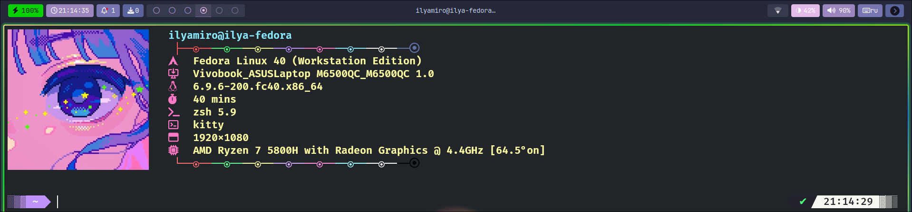

<h1>Ilyamiro's Dots</h1>

This repository contains my simple dots for <b>[waybar](https://github.com/Alexays/Waybar)</b>
This repo's main purpose is for me to track my waybar customization process.

But if you want to try these dots yourself, 
put these files into .config/waybar on your linux machine and enjoy!

<h2>Showcase</h2>




<h2>Modules</h2>
For almost all of the modules listed in modules file you can find a tutorial on <b>[wiki](https://github.com/Alexays/Waybar/wiki)</b> As for customones, they are listed below.

1. custom/update
This modules goal is to track updates on your **Fedora Workstation** system that uses dnf package manager
```
"custom/update": {
  "format":" {}",
  "exec": "bash $HOME/.config/waybar/scripts/checkupdates.sh",
  "exec-if": "[[ $($HOME/.config/waybar/scripts/checkupdates.sh) != -1 ]]",
  "on-click": "notify-send ' Downloading updates...' && sudo dnf update -y && notify-send 'The system has been updated'",
  "interval": 15,
  "tooltip": true,
  "return-type": "json",
}
```
It executes the following script:
```shell
#!/bin/bash

# Count the number of updates available
num_updates=$(sudo dnf check-update | tail -n +3 | wc -l)

# Get the list of packages available for update
tooltip=$(sudo dnf check-update | tail -n +3 | awk '{print $1}' | sort | head -n 50 | tr '\n' '\r')

# Calculate the number of additional updates
other_amount=$((num_updates - 50))

# Add the additional updates to the tooltip string
if [ $other_amount -gt 0 ]; then
    tooltip="$tooltip\rAnd $other_amount more..."
fi

json_obj="{\"text\": $num_updates, \"tooltip\": \"$tooltip\"}"

# Echo the number of updates available
echo "$json_obj"

```
And it looks like this:


It shows 50 first packages in aplphabetic order in it's tooltip.
Full amount of updates is showed on the module itself.
On-click updates the system.
